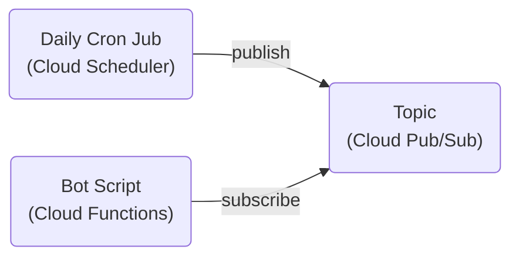

# 🦙 Alpaca Excerpt Bot

Extract news under topics of interest (MEV, security, development) from [DefiLlama Round Up](https://defillama.com/roundup) and forward to [DefiLlama Round Up for Devs](https://t.me/defillama_roundup_dev).

## Requirements

Service/API used in this bot.

### Google Cloud

1.  Create a [Google Cloud](https://cloud.google.com) account and a project.
2.  Set up a [Scheduler](https://cloud.google.com/secret-manager/docs/create-secret) for the daily
    cron job.
3.  Set up a [Pub/Sub](https://cloud.google.com/pubsub/docs/publish-receive-messages-console) topic.
4.  Install the [`gcloud`](https://cloud.google.com/sdk/gcloud) command line tool.

#### Architecture

The script itself is quite simple. Actually, more work is done on figuring out and setting up the
environment where it runs. I chose to deploy the bot on Google Cloud Functions (a serverless
platform). The following chart describe the overall architecture.

The cron job will publish an event to the topic daily, triggering the bot function to execute its
logic to crawl the Round Up content from DefiLlama's website, extract relevant news, and then send
an excerpt to the channel.

### Telegram

Obtain a [Telegram bot token](https://core.telegram.org/bots) and store it in Google Cloud
[Secret Manager](https://cloud.google.com/secret-manager/docs/create-secret).

## Deploy

1.  `yarn lint`: code formatting and linting.
2.  `yarn deploy`: build and deploy the bot.
3.  `yarn trigger`: manually trigger the bot function (often used for testing).

> **Note**
> The first time deploying the bot to Google Cloud, some warnings and errors will pop up asking for
> permissions, e.g. granting default service account access to Secret Manager. Simply follow the
> hints and set up the required permissions to proceed.

## Contribution

Absolutely welcome. Also feel free to reach out to discuss the project or anything else!

## License

[MIT](./LICENSE)
